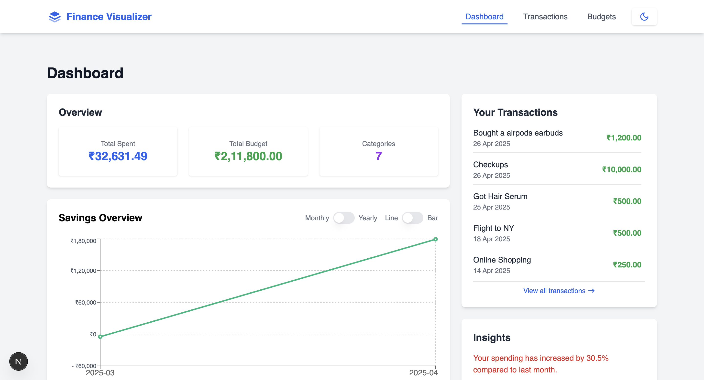
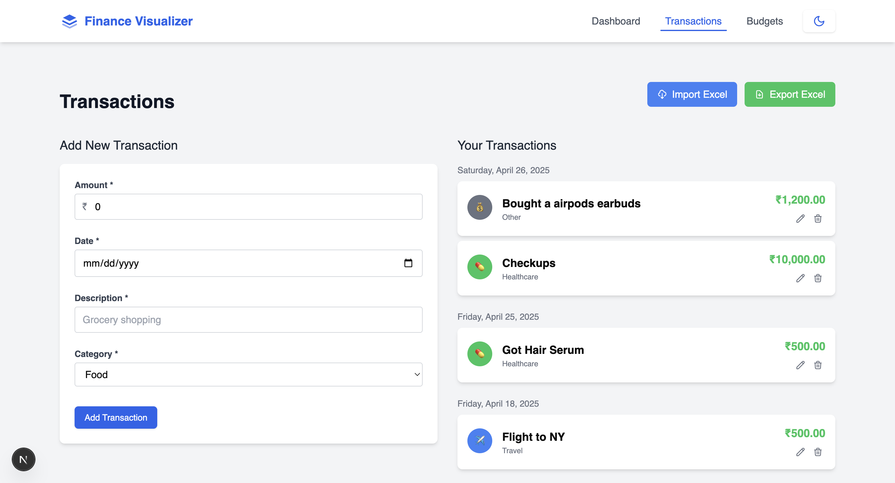
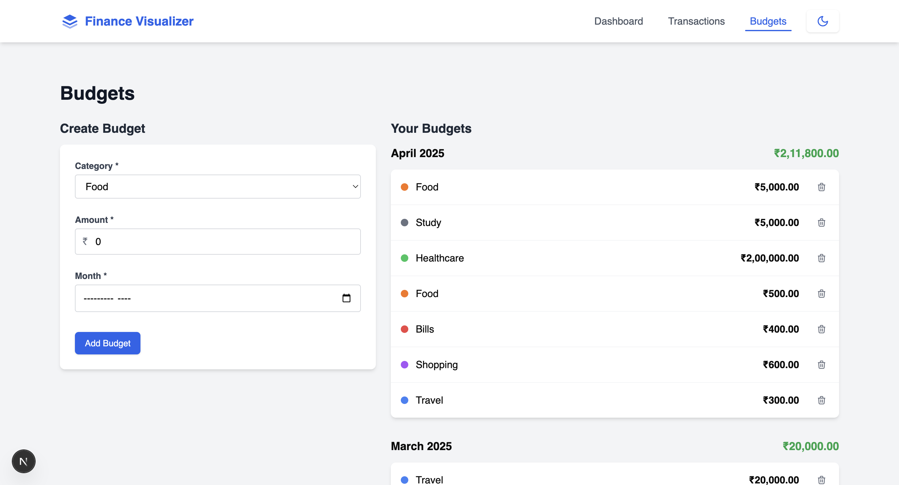

# Yardstick - Personal Finance Visualizer

> A simple, beautiful, and responsive web application for **tracking personal finances**, managing **budgets**, and gaining **spending insights**.

Built using modern web technologies:
- **Next.js 15** (React 19 based)
- **shadcn/ui** (for stylish components)
- **TailwindCSS**
- **MongoDB Atlas** (Database)
- **Recharts** (for interactive data visualization)

---

## ✨ Features

- **Transactions Management**
  - Add, edit, delete transactions (amount, date, description, category)
  - Monthly Expenses Bar Chart
  - Category-wise Pie Chart
  
- **Budget Management**
  - Set monthly budgets per category
  - Edit or delete existing budgets via modal UI
  - Budget vs Actual comparison chart
  - Simple Spending Insights summary

- **Savings Overview**
  - Calculate and visualize savings based on budgets vs spending
  - Toggle between Monthly and Yearly savings
  - Switch between Line Chart and Bar Chart view
  
- **Dark / Light Theme Toggle**

- **Fully Responsive Design**
  - Optimized for mobile, tablet, and desktop
  
- **Clean UX**
  - Toast notifications (react-hot-toast)
  - Loading spinners
  - Error handling with friendly messages
  - Animated charts and smooth interactions

---

## 🖼️ Project Screenshots

| Dashboard | Transactions | Budgets |
|:----------|:-------------|:--------|
|  |  |  |

---

## 🚀 Live Demo